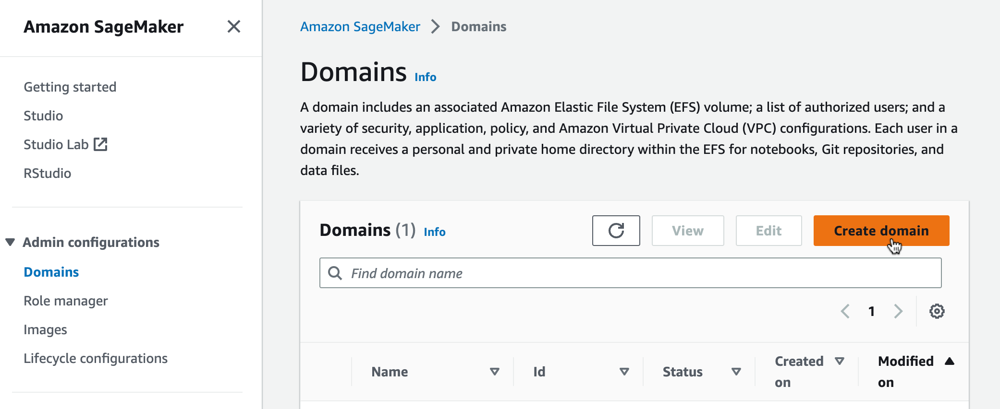
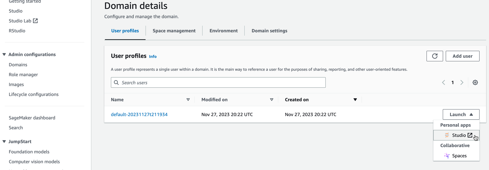
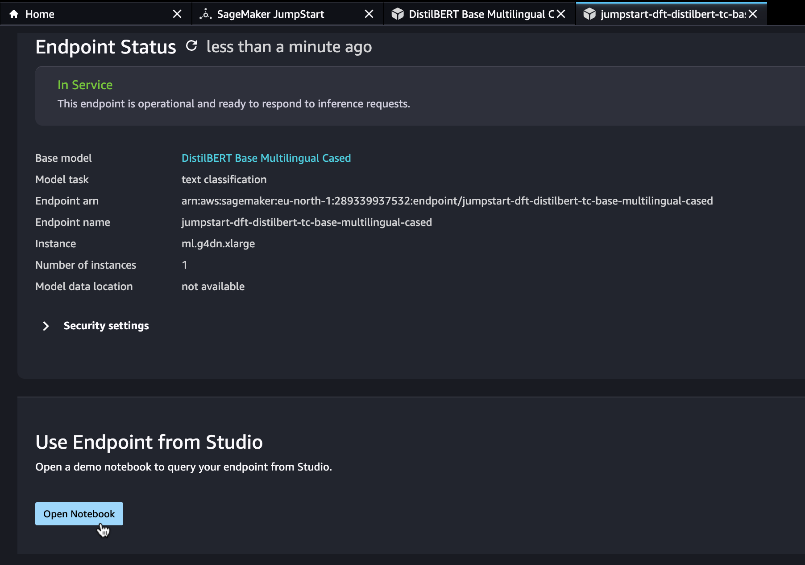
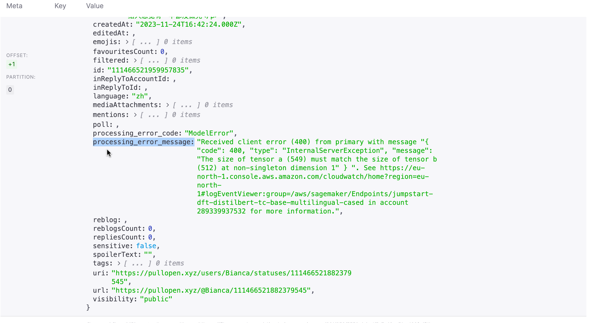

Ever wondered how to enrich your real-time streaming data with machine learning-driven analysis? Whether it is event or anomaly detection, automated alerts and notifications, network or sentiment analysis, you can leverage the power of machine learning algorithms to gain valuable insights and make informed decisions. By integrating machine learning into your real-time streaming data pipeline, you open up a world of possibilities for all kinds of data analysis.

In this tutorial, we'll show you an example of using a model run by SageMaker and usage of SageMaker Jupyter Notebooks to enrich the streaming data from an Apache Kafka topic. In particular, we’ll be working with Mastodon social network records and as the data flows through Kafka, we'll be enriching it with positive and negative sentiment information in real-time. The outcome will be stored in two separate topics: one for successful enrichment and another one for any issues that happened during analysis.

## What you will learn

- How to establish connection between an AWS SageMaker Jupiter Notebook and an Apache Kafka cluster.
- How to consume data from an Apache Kafka topic and enhance it using an AI model that runs on SageMaker.
- How to produce data back to Apache Kafka from the SageMaker Jupiter Notebook.

## Prerequisites

| Attributes                |                                                                                                                                                                                                                                                                                                                                                                                                                                                                                                                                                                                                                    |
| ------------------- |--------------------------------------------------------------------------------------------------------------------------------------------------------------------------------------------------------------------------------------------------------------------------------------------------------------------------------------------------------------------------------------------------------------------------------------------------------------------------------------------------------------------------------------------------------------------------------------------------------------------|
| ✅ AWS Level        | Intermediate - 200                                                                                                                                                                                                                                                                                                                                                                                                                                                                                                                                                                                                 |
| ⏱ Time to complete  | 20 minutes                                                                                                                                                                                                                                                                                                                                                                                                                                                                                                                                                                                                         |
| 💰 Cost to complete | Free when using the AWS Free Tier and Aiven for Apache Kafka                                                                                                                                                                                                                                                                                                                                                                                                                                                                                                                                                       |
| 🧩 Prerequisites    | - AWS account and access to SageMaker Studio. Follow this link to [set up your AWS account](https://aws.amazon.com/resources/create-account/) if you don’t have any. <br>- Apache Kafka. We’ll be using [Aiven for Apache Kafka cluster](https://aiven.io/kafka), which you can create at no cost for this tutorial as part of a free trial. Follow this link to [register for Aiven for Apache Kafka](https://go.aiven.io/olena-signup). <br>- Data for sentiment analysis. Follow [steps described in this article](https://aiven.io/developer/mastodon-kafka-js) to stream mastodon data to Apache Kafka topic. |
| 💻 Code Sample         | Code sample used in tutorial on [GitHub](https://raw.githubusercontent.com/Aiven-Labs/sentiment-analysis-kafka-sagemaker/main/sentiment-analysis.ipynb)                                                                                                                                                                                                                                                                                                                                                                                                                                                            |
| 📢 Feedback            | <a href="https://pulse.buildon.aws/survey/DEM0H5VW" target="_blank">Any feedback, issues, or just a</a> 👍 / 👎 ?                                                                                                                                                                                                                                                                                                                                                                                                                                                                                                  |
| ⏰ Last Updated     | 2023-11-28                                                                                                                                                                                                                                                                                                                                                                                                                                                                                                                                                                                                         |

| ToC |
|-----|

---

## Step 1 - Set up Apache Kafka cluster

### Secure connection between AWS SageMaker and Apache Kafka
To access Apache Kafka cluster from a Sagemaker Jupiter Notebook and establish a TLS connection you need to have this data from your cluster:
- service URI of your Apache Kafka cluster
- files containing access key,  access certificate and CA certificate of your Apache Kafka services.

All of those you can get from Aiven for Apache Kafka service landing page.


Keep this data ready, we'll use it in the steps below.

### Apache Kafka topics for input and output data
We'll need three topics in your Apache Kafka cluster:
- **social_media_messages** - this is the topic that contains data to be analised.
- **enriched_data** - this topic will be filled in with the analysis result
- **processing_errors** - this topic will be collecting information on the errors during data analysis.

When using Aiven for Apache Kafka you can do this via console interface:


Once done you should see three topics ready:


### Input data generation

We recommend you use [JavaScript-based data generator](https://github.com/Aiven-Labs/mastodon-to-kafka) to get a stream of social media data. However, you can also stream any other data that you want to perform analysis on, just make sure to adjust the property names in teh code.

## Step 2 - Set up Sagemaker and a Jupiter Notebook

To access to SageMaker studio you'll need to create a domain first:



Select Set up for single user (Quick setup) and wait till a new domain is established. Once all is ready click to open the studio:



Once you'll land into Amazon SageMaker Studio, 


Here you can search for one of already existing and trained models. We want a model that is trained to do text classifications. Different models have different advantages and disadvantages, select a model taking into account type of text you want to analyse and the length of text snippet. Social media messages from Mastodon are quite short so we will go for a model "DistilBERT Base Multilingual Cased". You can find it by using the search bar. Select the one for text classification:


Click to deploy the model and wait till it being prepared:


When the model is deployed open the demo notebook. You'll be prompted to set up notebook environment, you can agree to suggested values.



In this demo notebook you can make test requests for text classification. We'll be modifying the existing instructions as the part of the next step.

## Step 3 - Write code
Now it is time to write the code!  Feel free to clean the existing cells, we'll replace the example code with our own logic.

If you want to skip explanations and just to copy the result , load [the final notebook code](https://raw.githubusercontent.com/Aiven-Labs/sentiment-analysis-kafka-sagemaker/main/sentiment-analysis.ipynb) (don't forget to add the information about your Kafka instance!). Alternatively, follow the more detailed step-by-step instructions:

The first step is to install Apache Kafka python library. For this create a new cell and add this instruction:

```bash
  !pip install confluent-kafka
```

Next we'll import dependencies that we need:

```python
  from confluent_kafka import Producer, Consumer, KafkaError # to produce and consume data from Apache Kafka topics
  import boto3 # to programmatically create, configure, and manage AWS resources
  import json # to work with social media messages that are represented as JSON objects
  import re # for helper functionality to clean HTML tags from social media messages
```

Now let's define a function that we'll later use to run model inference and get predictions based in provided text:

```python
# Define a mapping dictionary to map model labels to negative/positive label
label_mapping = {'LABEL_0': 'negative', 'LABEL_1': 'positive'}

def get_prediction(text):
    endpoint_name = 'jumpstart-dft-distilbert-tc-base-multilingual-cased'
    client = boto3.client('runtime.sagemaker')
    query_response = client.invoke_endpoint(EndpointName=endpoint_name, ContentType='application/x-text', Body=text, Accept='application/json;verbose')
    model_predictions = json.loads(query_response['Body'].read())
    probabilities, labels, predicted_label = model_predictions['probabilities'], model_predictions['labels'], model_predictions['predicted_label']
    # Map the predicted_label to your the label using the mapping dictionary
    predicted_label = label_mapping.get(predicted_label, predicted_label)
    return probabilities, labels, predicted_label
```

Next, take files you got from your Apache Kafka instance and load them into the  folder next to the notebook file.


Once that is done, set up Apache Kafka connection properties:

```python
apache_kafka_ssl_config = {
    'ssl.ca.location': 'ca.pem',
    'ssl.certificate.location': 'service.cert',
    'ssl.key.location': 'service.key',
    'security.protocol': 'ssl',
}

apache_kafka_uri = 'your-apache-kafka-uri'

apache_kafka_input_topic_name = 'social_media_messages'
apache_kafka_enriched_output_topic_name = 'enriched_data'
apache_kafka_processing_errors_topic_name = 'processing_errors'
```

Create Apache Kafka consumer and logic to process consumed messages:

```python
consumer = Consumer({'bootstrap.servers': apache_kafka_uri, 'group.id': 'mygroup10', 'auto.offset.reset': 'earliest', **apache_kafka_ssl_config})
consumer.subscribe([apache_kafka_input_topic_name])

CLEANR = re.compile('<.*?>') 

def get_json_body(message):    
    decoded_message = message.value().decode('utf-8') # Decode from binary 
    json_message = json.loads(decoded_message)  # Parse JSON message
    return json_message

def get_clean_content(json_object):    
    content = json_object.get("content", "")  # Retrieve 'content' property    
    only_text = re.sub(CLEANR, '', content)
    return only_text
```
Create Apache Kafka producer and logic to process data that we want to send to the topics:

```python
producer = Producer({
    'bootstrap.servers': apache_kafka_uri, 
    **apache_kafka_ssl_config 
})

# Send a message to a Kafka topic
def send_message(message, topic_name):
    producer.produce(topic_name, json.dumps(message).encode('utf-8'))
    producer.flush()
    
def send_enriched_data(message, probabilities, predicted_label):
    message['probabilities'] = probabilities
    message['predition'] = predicted_label
    send_message(message, apache_kafka_enriched_output_topic_name)
    
def report_processing_error(message, error_code, error_message):
    message['processing_error_code'] = error_code
    message['processing_error_message'] = error_message
    send_message(message, apache_kafka_processing_errors_topic_name)
    
```

Finally, add a cell to start processing records from Apache Kafka input topic and enriching them:

```python
print(f"Processing messages")
while True:
    message = consumer.poll(1.0)  # Poll for messages, with a timeout of 1 second

    if message is None:
        continue

    if message.error():
        if message.error().code() == KafkaError._PARTITION_EOF:
            # End of partition event
            print(f"Reached end of partition for topic {message.topic()} [{message.partition()}]")
        else:
            print(f"Error while consuming message: {message.error()}")
    else:
        # Process the message
        json_body = get_json_body(message)
        content_property = get_clean_content(json_body)
        if content_property == "":
            continue

        try:
            probabilities, labels, predicted_label = get_prediction(content_property)
            print(f"Inference:\n"
                  f"Input text: '{content_property}'\n"
                  f"Model prediction: {probabilities}\n"
                  f"Predicted label: {predicted_label}\n")

            send_enriched_data(json_body, probabilities, predicted_label)
            

        except Exception as e:
            print(f"An error occurred: {e}")
            response = getattr(e, "response", {})
            error_code = response.get("Error", {}).get("Code", "Unknown")
            error_message = response.get("Error", {}).get("Message", "Unknown")
            report_processing_error(json_body, error_code, error_message)
            

# Close the consumer
consumer.close()
```

Great! This is all the code that we need.

## Step 4 - Running and testing

Run notebook cells, see output for processed messages. Each record should now contain additional properties on probabilities and a prediction done by model.


To see that data was successfully sent to Apache Kafka topic **enriched_data** go to "Topic messages", select JSON format and click to fetch the messages:


Now you can go through all the processed records:


You can also check the topic with errors that occured during processing:



## Clean up
Don't forget to clean up the resources you've used.
For Sagemaker you need to clean up created Endpoint, Endpoint configuration, running Model and Notebook instances. 
https://docs.aws.amazon.com/sagemaker/latest/dg/ex1-cleanup.html

For Aiven for Apache Kafka select "Delete service" in the menu:


## Conclusion

And that's it! We just created a pipeline to process and analyse sentiment behind social media messages in real time. We used python client library to create a producer and a consumer for Apache Kafka topic and one of the available multi-language models for text classifications.

If you enjoyed this tutorial, found any issues, or have feedback for us, <a href="https://pulse.buildon.aws/survey/DEM0H5VW" target="_blank">please send it our way!</a>